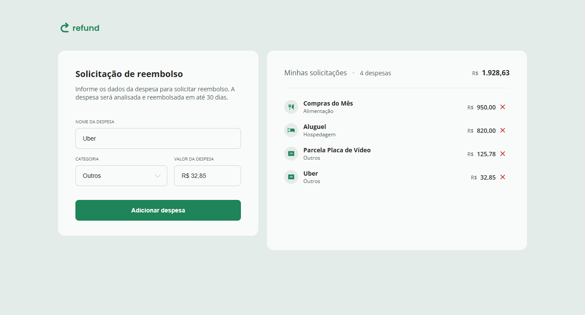

# 📋 Quicklist

Mais um dos desafios propostos pela Rocketseat, este é uma aplicação que poderá anotar gastos constantes e obter uma base de com o que gastou de maneira organizada e bem categorizada.

## 📑 Índice

- [Tecnologias Utilizadas](#️-tecnologias-utilizadas)
- [UI](#-ui)
- [Funcionalidades](#️-funcionalidades)
- [Como Rodar o Projeto](#️-como-rodar-o-projeto)
- [Agradecimentos](#️-agradecimentos)

## 🛠️ Tecnologias Utilizadas

### 🔎 Front-end

- **HTML/CSS** - Design do site e responsividade
- **JavaScript** - Funções e estilização mais avançada

  

## 📷 UI

## ⚙️ Funcionalidades

- Gastos gerenciados de maneira organizada
- Categorização de gastos
- Cálculo de quantidade total gasta

## 🚀 Como Rodar o Projeto

- 🔗 Link - [Refund](https://jefolidev.github.io/refund/)

## 👥 Fale comigo!

Achou meu repertório interessante e gostaria de contratar um freela ou talvez me contratar para tornar acrescenter no seu negócio? Entre em contato comigo e vamos marcar.

  
  

